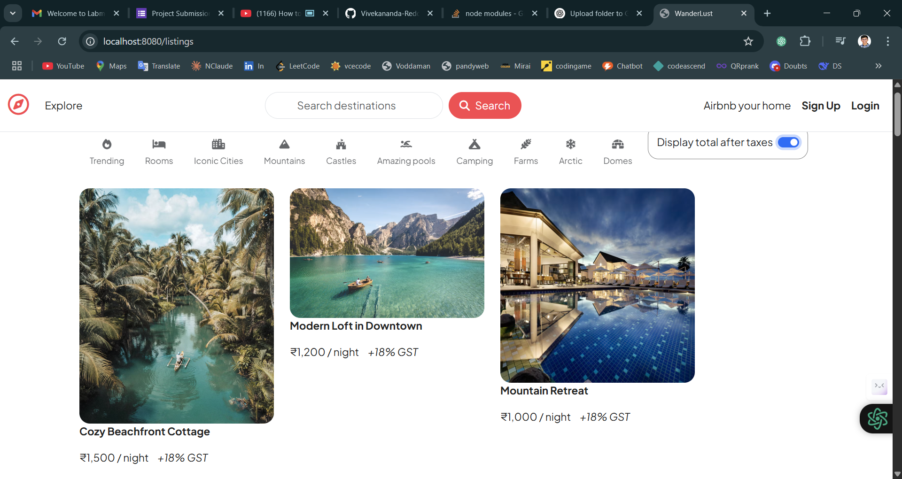
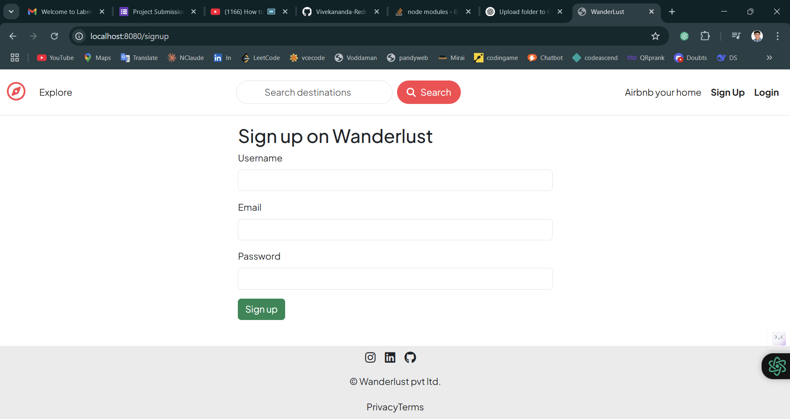
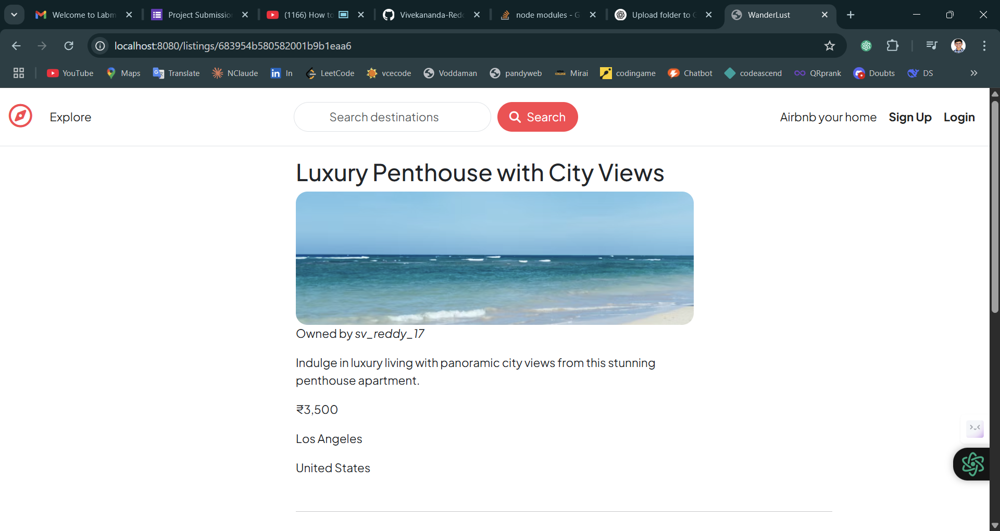

# 🏠 Airbnb Clone

A full-featured **Airbnb Clone** web application built using **Node.js**, **Express.js**, **MongoDB**, and **EJS**, with full **authentication**, **image uploads**, and **Map integration** via **Mapbox API**.

This project allows users to create, view, update, and delete listings with support for geolocation and photo uploads.

---

## 🚀 Tech Stack

- **Frontend**: EJS, CSS, Bootstrap
- **Backend**: Node.js, Express.js
- **Database**: MongoDB, Mongoose
- **Auth**: Passport.js (Local Strategy)
- **Image Upload**: Multer + Cloudinary
- **Maps**: Mapbox Geocoding & Maps API

---

## ✨ Features

- ✅ User registration & login
- ✅ Auth-protected routes with session-based auth
- ✅ CRUD operations on listings
- ✅ Image upload with Cloudinary
- ✅ Geolocation & interactive maps with Mapbox
- ✅ Flash messages and form validation
- ✅ Clean and responsive UI using Bootstrap

---

## 📁 Project Folder Structure

Airbnb-Clone/
├── public/ # Static files (CSS, client JS, images)
│ ├── css/
│ └── js/
├── views/ # EJS templates
│ ├── partials/
│ ├── listings/
│ ├── users/
│ └── home.ejs
├── models/ # Mongoose schemas
│ ├── listing.js
│ └── user.js
├── routes/ # Express route handlers
│ ├── listings.js
│ └── users.js
├── middleware/ # Custom middleware (e.g., auth, validation)
├── utils/ # Helpers (Cloudinary, Mapbox, etc.)
│ ├── cloudinary.js
│ └── geocode.js
├── node_modules/
├── .env
├── .gitignore
├── app.js # Main server entry point
├── package.json
└── README.md

yaml
Copy
Edit

---

## 🔧 Setup Instructions

### 1. Clone the repo

```bash
git clone https://github.com/Vivekananda-Reddy-17/AirBnb-Clone.git
cd AirBnb-Clone
2. Install dependencies
bash
Copy
Edit
npm install
3. Create a .env file in the root directory
env
Copy
Edit
MAPBOX_TOKEN=your_mapbox_api_key
CLOUDINARY_CLOUD_NAME=your_cloudinary_name
CLOUDINARY_KEY=your_cloudinary_api_key
CLOUDINARY_SECRET=your_cloudinary_secret
MONGO_URL=your_mongodb_connection_string
SESSION_SECRET=your_own_secret
PORT=3000
4. Run the app
bash
Copy
Edit
npm start
Or for development:

bash
Copy
Edit
nodemon app.js
📦 Main Dependencies
express

ejs

mongoose

dotenv

passport, passport-local, express-session

method-override

connect-flash

multer, cloudinary, multer-storage-cloudinary

axios

mapbox

express-validator (optional)

📸 Screenshots




🙌 Acknowledgements
Project inspired by Airbnb

Based on patterns taught in Colt Steele’s Web Dev Bootcamp

Maps powered by Mapbox

Image hosting via Cloudinary

📄 License
This project is open-source and free to use for educational or learning purposes.

yaml
Copy
Edit

---

